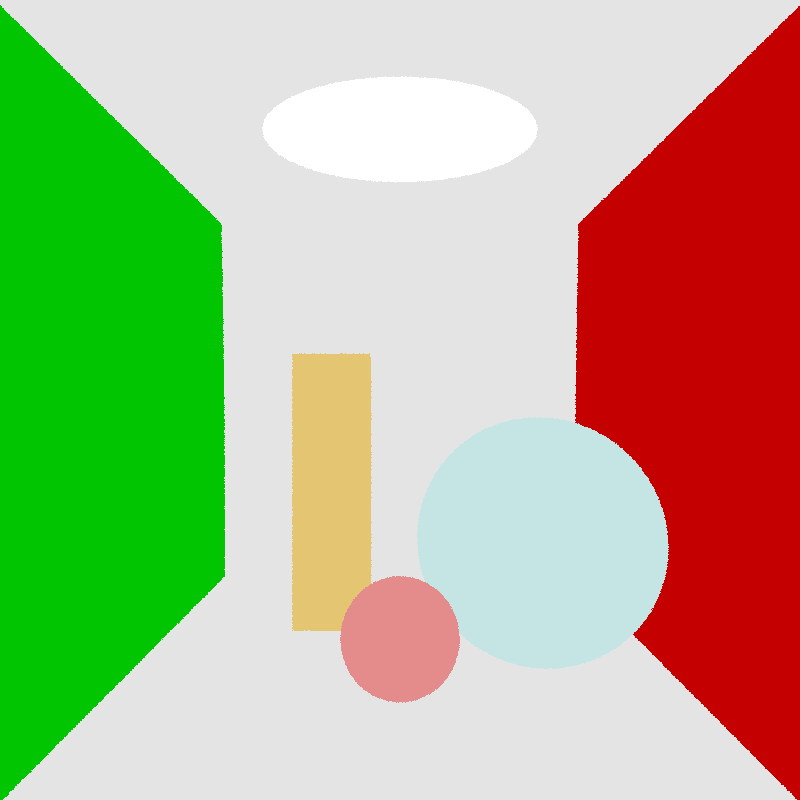
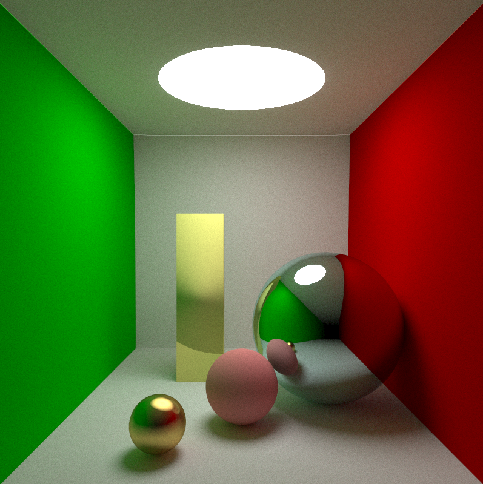
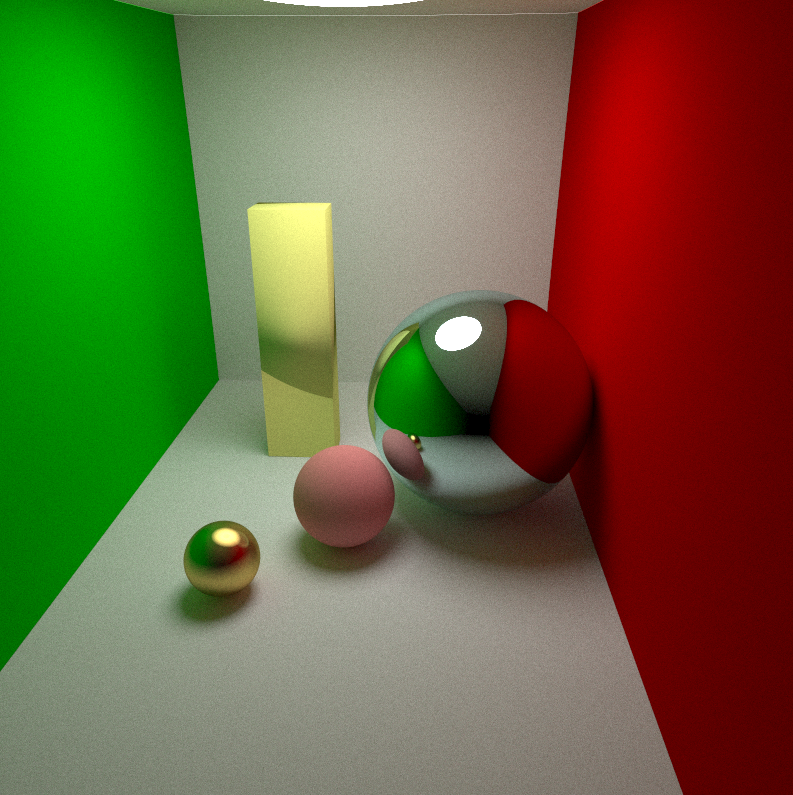

# 太极图形课S1-L5
### 可控相机
对Camera类做了些小修改，目前支持对相机进行以下控制：
1. 注视点(lookat)跟随鼠标移动
2. 鼠标左键**前进**， 右键**后退**
3. WASD及方向键控制相机移动

目前相机一旦移动后就要重新渲染整个画面，所以只用color来看相机移动的效果。很好奇实时渲染应该怎么做

### 在场景中增加物体
一开始想增加一个甜甜圈(Torus)，但是查了如下两个链接后，果断放弃 orz

目前实现了增加一个长方体(Box)，调试了一下后发现效果还行 =v=

## 效果展示
### 可控相机

### 不同视角下长方体渲染

## 运行方式
相机： `python3 color_only.py`

观察长方体： `python3 path_tracing.py`